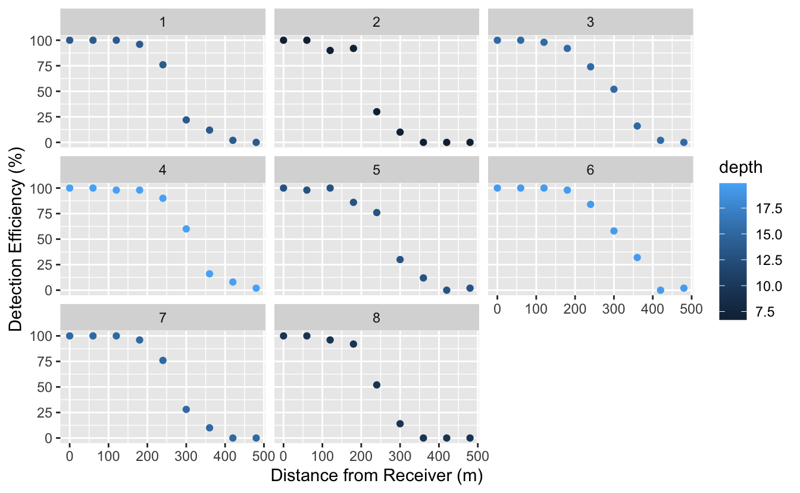
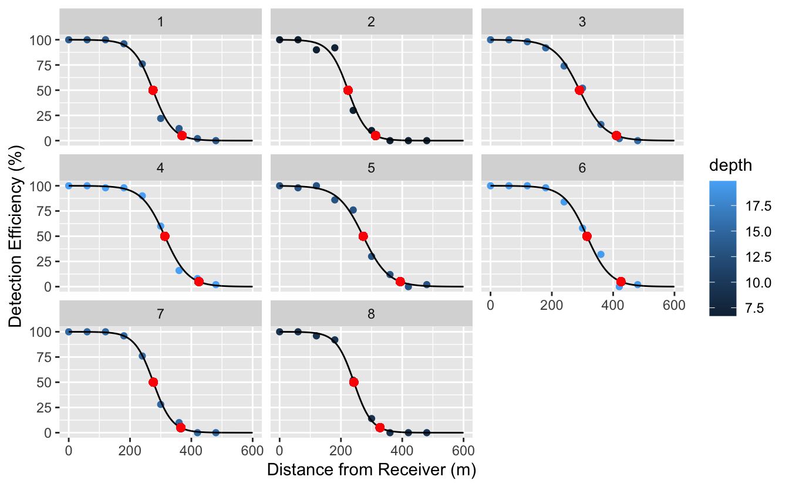

I have been reading [this great paper](https://besjournals.onlinelibrary.wiley.com/doi/abs/10.1111/2041-210X.13322) by Jacob Brownscombe et al., which outlines a practical approach to accounting for detection range (DR) variation in acoustic telemetry arrays. I am a little ashamed to say that this is something I haven't thought a lot about, despite working with acoustic telemetry data a fair bit. As an example of the pitfalls of failing to account for variation in DR, Brownscombe points to a study by Payne et al. (2010) on the diel patterns in use of nearshore habitats by cuttlefish. Whereas the raw data showed that cuttlefish used these areas more during the day, the corrected data showed that they used these areas more at night. Not only did this affect the effect size, but it completely changed the directionality of the effect, which fundamentally changes our understanding of the species biology and how to manage them!

# Why is there variation in detection range?

In acoustic telemetry studies, we typically set up an array of stationary receivers within a study area and tag some animals with acoustic transmitters. These animals (let's say fish) swim around sending out supersonic acoustic transmissions every few seconds. When the fish passes within the receivers detection range, the receiver records the unique id of the transmitter and time of detection. So far, pretty straightforward (at least from a data perspective, not logistically!) The tricky part is that **detection efficiency (DE) decreases with distance from receiver and the DR for each receiver varies in space and time**.

So what causes this variation?  
First, these acoustic signals may never reach the receiver as they can be:

1.  attenuated, retracted, or lost due to spreading in water.  
2.  disrupted by physical barriers.  
3.  muted by environmental or biological noise.

Second, the signal could be wrongly interpreted by the receiver (i.e. false detection) if:  
1. tags are mutated by noise but still decoded by a receiver.  
1. tags operating on the same frequemcy collide with one another and arrive at the receiver simultaneously.

These are imperfect sampling systems that are affected by conditions in the surrounding environment (e.g. rugosity, depth, anthropogenic or environmental noise) and how many other tags exist in the study area (with more tags leading to less DE).

# How do we deal with this variation to correct our analyses?

Frist some definitions:  
- **DR** - the 3-dimensional space surrounding a receiver that a transmitter can be detected in  
- **DE** (%) - \# detections in given time period / total expected detections based on transmission rate \* 100  
- **MR** - estimated distance from receiver with 5% DE  
- **Midpoint** - estimated distance from receiver with 50% DE  
- **DEv** - difference between detection efficiency in given time period and mean detection efficiency of reference tag  
- **DEvc** - DEv standardized to +/- 50% (across receivers)  
- **DRc** - DR correction facto derived from MR and DEvc  
- **Det** - number of detections  
- **Detc** - number of detections corrected using DRc

Brownscombe suggests a practical approach to deal with this issue:  
1. **Select a set of sentinel receivers** that represent the full range of environmental conditions (these will be used to predict DE at the rest of the receivers) and measure/record site characteristics in space (e.g. depth, benthos) and time (e.g. tide, diel period).  
1. **Quantify the MR and Midpoint** at each sentinel receiver. This can be done by dropping a tag at various distances from a receiver, measuring DE and modelling the relationship between efficiency and distance to estimate the Midpoint and MR.  
1. **Quanitfy the variance in DE** (DEv) at each sentinel receiver. This is done by dropping a reference tag (i.e., tag with longer transmission delay \~200-700 seconds) at the Midpoint (e.g. 200m away) and leaving it there for the duration of the study.  
1. **Calculate detection range correction factor** (DRc). This uses DEv and MR.  
1. **Model relationship between DRc and site characteristics** to predict DRc at other receivers in array.  
1. **Correct detection data** using predicted DRc.

To make this process more clear, I'll simulate some data and show the R code to calculate each step. Note that I referenced the code provided in Brownscombe et al. supplementary info, but have modified it quite a bit.

# Calculate Midpoint and MR

Step 1: Create some fake receivers at different depths, half of which are sentinels.

<pre class='chroma'><code class='language-r' data-lang='r'>nrec &lt;- 16
<a href='https://rdrr.io/r/base/Random.html'>set.seed</a>(99)

rec &lt;- <a href='https://rdrr.io/r/base/data.frame.html'>data.frame</a>(receiver = 1:nrec,
             depth = <a href='https://rdrr.io/r/stats/Uniform.html'>runif</a>(nrec, 5, 20),
             sentinel = <a href='https://rdrr.io/r/base/c.html'>c</a>(TRUE, FALSE))
rec
#&gt;    receiver     depth sentinel
#&gt; 1         1 13.770678     TRUE
#&gt; 2         2  6.706725    FALSE
#&gt; 3         3 15.263971     TRUE
#&gt; 4         4 19.887632    FALSE
#&gt; 5         5 13.024904     TRUE
#&gt; 6         6 19.499211    FALSE
#&gt; 7         7 15.071413     TRUE
#&gt; 8         8  9.418666    FALSE
#&gt; 9         9 10.375445     TRUE
#&gt; 10       10  7.629721    FALSE
#&gt; 11       11 13.232261     TRUE
#&gt; 12       12 12.581776    FALSE
#&gt; 13       13  7.907547     TRUE
#&gt; 14       14 14.553562    FALSE
#&gt; 15       15 15.317001     TRUE
#&gt; 16       16 14.602862    FALSE</code></pre>

Step 2: Simulate some detection range data, where depth has an effect on the DE curve.

<pre class='chroma'><code class='language-r' data-lang='r'><a href='https://rdrr.io/r/base/library.html'>library</a>(<a href='https://ggplot2.tidyverse.org'>ggplot2</a>)
<a href='https://rdrr.io/r/base/library.html'>library</a>(<a href='https://poissonconsulting.github.io/extras/'>extras</a>)
<a href='https://rdrr.io/r/base/library.html'>library</a>(<a href='http://purrr.tidyverse.org'>purrr</a>)

dr &lt;- <a href='https://purrr.tidyverse.org/reference/map.html'>map_df</a>(<a href='https://rdrr.io/r/base/seq.html'>seq_along</a>(rec$receiver[rec$sentinel]), function(x)&#123;
  df &lt;- rec[x,]
  
  distance &lt;- <a href='https://rdrr.io/r/base/seq.html'>seq</a>(0, 500, 60)
  b0 &lt;- <a href='https://poissonconsulting.github.io/extras/reference/logit.html'>logit</a>(0.99)
  bDist &lt;- -0.027   
  bDepth &lt;- 0.2
  z &lt;- b0 + bDist * distance + bDepth * df$depth 
  pr &lt;- <a href='https://poissonconsulting.github.io/extras/reference/ilogit.html'>ilogit</a>(z)
  
  nsample &lt;- 50
  success &lt;- <a href='https://rdrr.io/r/stats/Binomial.html'>rbinom</a>(<a href='https://rdrr.io/r/base/rep.html'>rep</a>(1, <a href='https://rdrr.io/r/base/length.html'>length</a>(pr)), nsample, pr)
  failure &lt;- nsample - success
  de &lt;- success/nsample
  
  dr &lt;- <a href='https://rdrr.io/r/base/data.frame.html'>data.frame</a>(receiver = x,
               depth = df$depth,
               distance = distance,
               success  = success,
               failure = failure,
               de = de)
&#125;)

<a href='https://ggplot2.tidyverse.org/reference/ggplot.html'>ggplot</a>(data = dr) +
  <a href='https://ggplot2.tidyverse.org/reference/geom_point.html'>geom_point</a>(<a href='https://ggplot2.tidyverse.org/reference/aes.html'>aes</a>(x = distance, y = de*100, color = depth)) +
  <a href='https://ggplot2.tidyverse.org/reference/facet_wrap.html'>facet_wrap</a>(~receiver) + 
  <a href='https://ggplot2.tidyverse.org/reference/labs.html'>labs</a>(x = "Distance from Receiver (m)", y = "Detection Efficiency (%)")
</code></pre>

We can estimate the Midpoint and MR for each sentinel receiver by modelling the relationship between DE and distance for each receiver. Here, we use a generalized linear model with binomial family (logistic regression), although Brownscombe et al. used a third-order polynomial liner regression with forced y-intercept at 1.

<pre class='chroma'><code class='language-r' data-lang='r'># create models for each sentinel receiver
rec &lt;- <a href='https://rdrr.io/r/base/unique.html'>unique</a>(dr$receiver)
models &lt;- <a href='https://purrr.tidyverse.org/reference/map.html'>map</a>(rec, function(x)&#123;
  dat &lt;- dr[dr$receiver == x,]
  <a href='https://rdrr.io/r/stats/glm.html'>glm</a>(<a href='https://rdrr.io/r/base/cbind.html'>cbind</a>(success, failure) ~ distance, data = dat, family = "binomial")
&#125;) %&gt;% <a href='https://purrr.tidyverse.org/reference/set_names.html'>set_names</a>(rec)

# function to calculate distance for a desired DE value
calc_distance_at_de &lt;- function(model, value) &#123;
  find_int &lt;- function(model, value) &#123;
    function(x)&#123;
      <a href='https://rdrr.io/r/stats/predict.html'>predict</a>(model, <a href='https://rdrr.io/r/base/data.frame.html'>data.frame</a>(distance = x), type = "response") - value
    &#125;
  &#125;
  <a href='https://rdrr.io/r/stats/uniroot.html'>uniroot</a>(find_int(model, value), <a href='https://rdrr.io/r/base/range.html'>range</a>(dr$distance))$root
&#125;

# sequence of distance values to predict DE on
distvals &lt;- <a href='https://rdrr.io/r/base/seq.html'>seq</a>(0, 600, 1)

# for each receiver and it's respective model, predict over range of distance values and 
# estimate Midpoint and MR
preds &lt;- <a href='https://purrr.tidyverse.org/reference/map.html'>map_df</a>(rec, function(x)&#123;
  predvals &lt;- <a href='https://rdrr.io/r/stats/predict.html'>predict</a>(models[[x]], <a href='https://rdrr.io/r/base/list.html'>list</a>(distance = distvals), type = "response")
  midpoint &lt;- calc_distance_at_de(models[[x]], 0.5)
  mr &lt;- calc_distance_at_de(models[[x]], 0.05)
  <a href='https://rdrr.io/r/base/data.frame.html'>data.frame</a>(receiver = x,
             distance = distvals,
             predvals = predvals,
             midpoint = midpoint,
             mr = mr)
&#125;)

<a href='https://ggplot2.tidyverse.org/reference/ggplot.html'>ggplot</a>(data = dr) +
  <a href='https://ggplot2.tidyverse.org/reference/geom_point.html'>geom_point</a>(<a href='https://ggplot2.tidyverse.org/reference/aes.html'>aes</a>(x = distance, y = de*100, color = depth)) +
  <a href='https://ggplot2.tidyverse.org/reference/geom_path.html'>geom_line</a>(data = preds, <a href='https://ggplot2.tidyverse.org/reference/aes.html'>aes</a>(x = distance, y = predvals*100), colour="black") +
  <a href='https://ggplot2.tidyverse.org/reference/geom_point.html'>geom_point</a>(data = preds, <a href='https://ggplot2.tidyverse.org/reference/aes.html'>aes</a>(x = midpoint, y = 50), color = "red", size = 2) +
  <a href='https://ggplot2.tidyverse.org/reference/geom_point.html'>geom_point</a>(data = preds, <a href='https://ggplot2.tidyverse.org/reference/aes.html'>aes</a>(x = mr, y = 5), color = "red", size = 2) +
  <a href='https://ggplot2.tidyverse.org/reference/facet_wrap.html'>facet_wrap</a>(~receiver) + 
  <a href='https://ggplot2.tidyverse.org/reference/labs.html'>labs</a>(x = "Distance from Receiver (m)", y = "Detection Efficiency (%)")
</code></pre>

Now that we've calculated our Midpoints for each sentinel, let's put a reference tag there to calculate DE over time. We'll simulate some data where DE has a positive relationship with day and the magnitude of the effect increases with depth. This is not very realistic (a seasonal effect would be better and I don't know if influence of depth is a realistic mechanism) but it'll work just for demonstration purposes.

